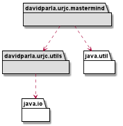
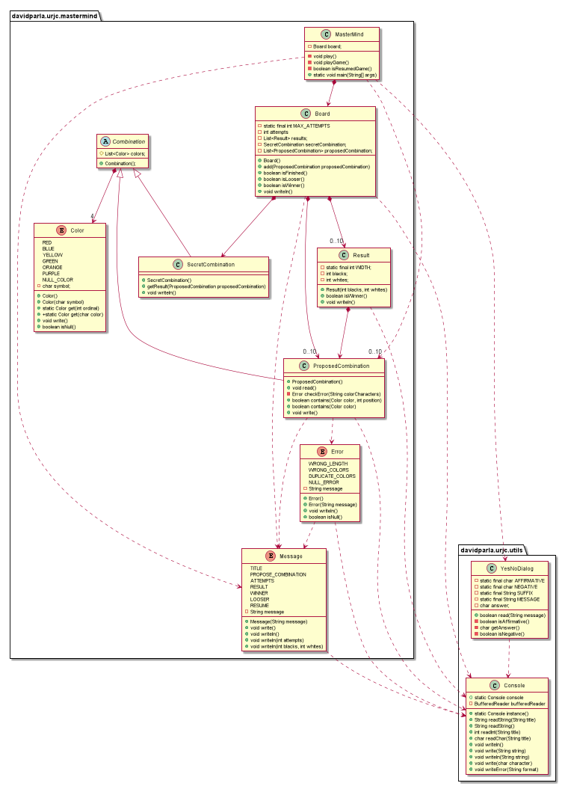

# MasterMind. Solución domainModel
Pedro David Parla Garcia - pd.parla@alumnos.urjc.es 
Version 0.0.1

# Indice
 - [Funcionalidad básica](#Funcionalidad-básica)
 - [Vista de Lógica/Diseño](#Vista-de-Lógica/Diseño)
    * Arquitectura
    * Paquete mastermind

# Funcionalidad básica
 - [Wiki](https://en.wikipedia.org/wiki/Mastermind_(board_game))
    - Funcionalidad: Básica
    - Interfaz: Texto
    - Distribución: StandAlone
    - Persistencia: No
 
    
 
# Vista de Lógica/Diseño

## Arquitectura

## Paquete mastermind

