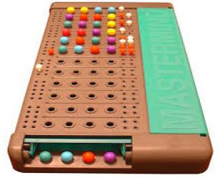

<!DOCTYPE html>
<html lang="en">
   <head>
      <meta charset="UTF-8">
      <meta http-equiv="X-UA-Compatible" content="IE=edge">
      <meta name="viewport" content="width=device-width, initial-scale=1.0">
      <meta name="generator" content="Asciidoctor 2.0.8">
      <meta name="author" content="David Parla">
      <link rel="stylesheet" href="https://fonts.googleapis.com/css?family=Open+Sans:300,300italic,400,400italic,600,600italic%7CNoto+Serif:400,400italic,700,700italic%7CDroid+Sans+Mono:400,700">
      <link rel="stylesheet" href="https://cdnjs.cloudflare.com/ajax/libs/font-awesome/4.7.0/css/font-awesome.min.css">
   </head>
   <body class="book">
      

         <h1>MasterMind</h1>
         

            David Parla 
            <a href="mailto:pd.parla@alumnos.urjc.es">pd.parla@alumnos.urjc.es</a> 
            version 0.0.1
         

         

            
Index

            <ul class="sectlevel1">
               <li><a href="#mastermind-rules">Rules</a></li>
               <li><a href="#mastermind-model-domain">Domain Model</a></li>
            </ul>
         

      

      

         

            <h2 id="mastermind-rules">Rules</h2>
            

               <table class="tableblock frame-all grid-all stretch">
                  <colgroup>
                     <col style="width: 50%;">
                     <col style="width: 50%;">
                  </colgroup>
                  <tbody>
                     <tr>
                        <td class="tableblock halign-left valign-top">
                           

                              

                                 <ul>
                                    <li>
                                       
<a href="https://en.wikipedia.org/wiki/Mastermind_(board_game)"><strong>Wiki</strong></a> - <a href="https://www.youtube.com/watch?v=2-hTeg2M6GQ"><strong>Youtube</strong></a>

                                       

                                    </li>
                                 </ul>
                              

                           

                        </td>
                        <td class="tableblock halign-left valign-top">
                           

                              

                                 

                                    
                                 

                              

                           

                        </td>
                     </tr>
                  </tbody>
               </table>
            

         

         

            <h2 id="mastermind-model-domain">Model Domain</h2>
            

               

                  

                     
                  

               

            

         

      

      

         

            Version 0.0.1 
            Last updated 2020-23-10 15:10:00 +0000
         

      

      </body>
</html>